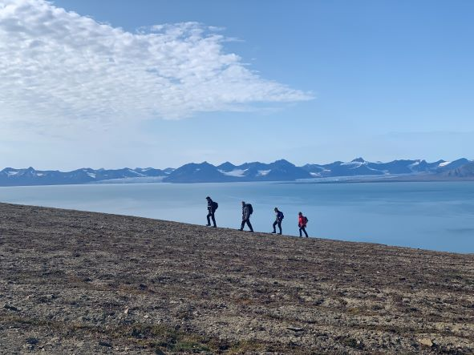
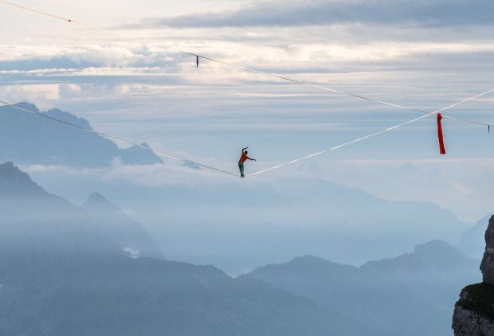

# liga.prancane
## Par mani:

**Sveiki!** 
Mans vārds ir Līga.
Šobrīd strādāju ļoti foršā izstrādes komandā kā testētājs. Šī ir pirmā pieredze testētāja darbā. Jau ir 
apgūtas sistēmas ar kurām jāstrādā, vairāk saprasti biznesa procesi, sāku ievērot, kādas lietas varētu nocelt no saviem
ikdienas darbiem un uzticēt sistēmām. Tā nu sāku apgūt testēšanas automatizēšanu. Saprast tās iespējas un savu varēšanu. :)

Mana darba ikdiena paiet pie datora, tāpēc brīvajā laikā cenšos izkustēties, kā arī piešķilt ikdienai radošāku dzirksti.

## Kā uzlādēt baterijas:

**Vislabāk** prāts un ķermenis atpūšas atrodoties **dabā** un **kustībā**. Kopā ar draugiem dodamies pārgājienos, izbraucienos,
kempingojam pie jūras un ezeriem. Ideāli, ja vēl šos pasākumus papildina uz ugunskura gatavots ēdiens. 
Ļoti patīk doties laivu braucienos. Šogad plānoju vismaz septiņus izbraucienus ar laivām, trīs jau ir! :)

Mana sirdslieta ir dejošana, gandrīz visu dzīvi esmu dejojusi. Pamatā tautas dejas, paralēli paķerot arī citus dejus stilus,
piemēram, swing dejas, Lindy hop, arī šo to no breika elementiem un izmēģināju arī stepu.

Aizrauj ceļošana. Ir vēl ļoti daudzas vietas, kuras vilina. Tuvākajā laikā ceru aizbraukt uz Āziju 
un pieredzēt kaut ko pavisam atšķirīgu.
**_Top3_** ceļojumi līdz šim ir Portugāle (Azoras), Gruzija un Arktika.

Ļoti bieži mani var sastapt lasot grāmatas. Tas ir veids, kā uz brīdi teleportēties uz pavisam citu pasauli. :)

## Mazie sapnīši:

* Staigāt pa virvēm lielos augstumos. [Iedvesmai](https://www.youtube.com/watch?v=hVylG6ngWb8&ab_channel=GuinnessWorldRecords)

* Spēlēt bungas
 
